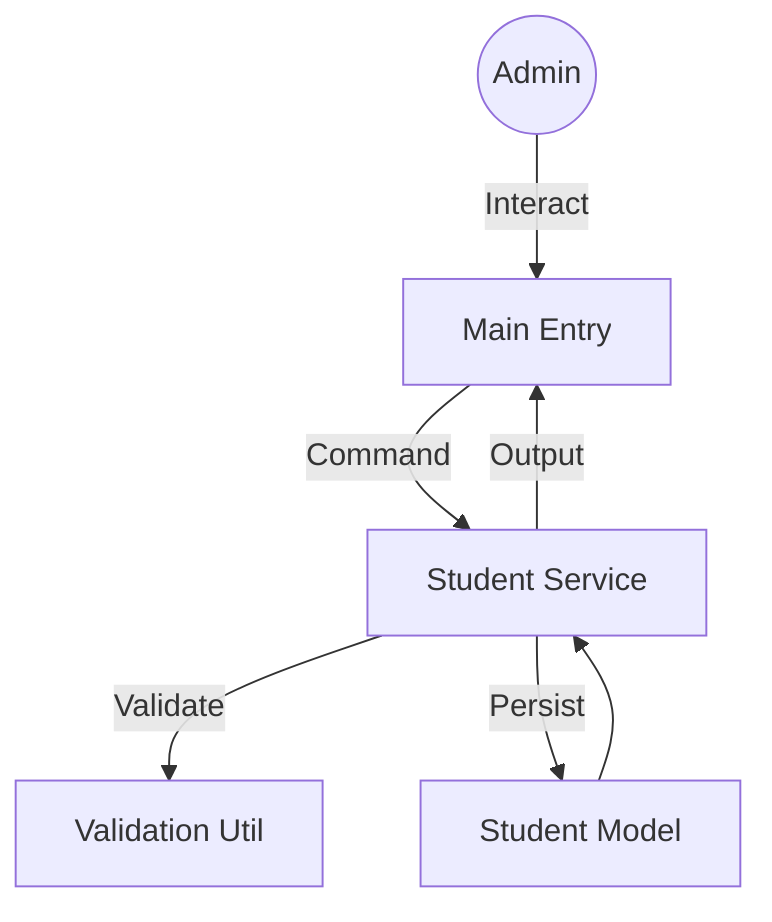

# 🎓 Student Management System: Enterprise Academic Registry

[](https://www.java.com/)
[](PROJECT_STRUCTURE.md)
[](LICENSE)
[](https://github.com/singh-aadarsh330/student-management-system/stargazers)

## 🏗️ Project Overview

The **Student Management System** is a professional-grade, console-based Java application engineered for high-efficiency academic record management. It demonstrates advanced **Object-Oriented Programming (OOP)** principles, clean architecture, and robust input validation.

This system provides a streamlined interface for administrators to perform complex CRUD operations with data integrity and optimal time complexity.

## ✨ Key Features

- **🚀 High-Performance CRUD**: Efficiently Manage, Search, and Archive student records.
- **🛡️ Data Integrity**: Multi-layered validation for Emails, Marks, and Age ranges.
- **🏗️ Layered Architecture**: Clear separation between Model, Service, and Presentation layers.
- **📊 Real-time Analytics**: Built-in complexity analysis and record telemetry.
- **🔐 Unique ID Enforcement**: Ensures no duplicate registries via service-level validation.

## 🛠️ Tech Stack

- **Core**: Java 17+
- **Pattern**: Model-Service-Repository (In-Memory)
- **Data Structures**: `ArrayList` for dynamic persistence.
- **Validation**: Regex-based email verification and range constraints.

## 🚀 Getting Started

### Prerequisites
- JDK 17 or higher
- Git

### 1. Clone the Repository
```bash
git clone https://github.com/singh-aadarsh330/student-management-system.git
cd student-management-system
```

### 2. Compilation
```bash
javac main/Main.java model/Student.java service/StudentService.java util/ValidationUtil.java
```

### 3. Execution
```bash
java main.Main
```

## 📁 Project Structure

```text
├── main/               # Application Entry & UI logic
├── model/              # Data entities (Student POJO)
├── service/            # Business logic & Core operations
├── util/               # Cross-cutting validation utilities
└── PROJECT_STRUCTURE.md # Detailed architecture breakdown
```

## 🧠 Architecture Diagram



## 📜 License
Licensed under the MIT License. See [LICENSE](LICENSE) for details.

## 👤 Author
**Aadarsh Singh**
- GitHub: [@singh-aadarsh330](https://github.com/singh-aadarsh330)
- LinkedIn: [Aadarsh Singh](https://www.linkedin.com/in/aadarsh-singh-kiit)

---
*⭐ Give this project a star if it helps your Java learning journey!*
